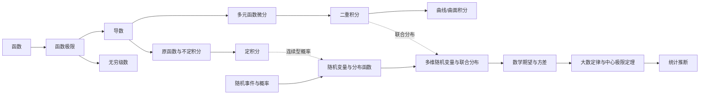

# 张宇基础30讲知识关联（候选）

> [!warning] Staging
> 本目录仅供导入前审阅。概念说明是通用概览，MinerU 页码只是词项定位候选，全部保持“待人工校验”。

## 入口

- [[02-知识点/00-知识点索引|知识点索引]]
- [[03-题型与方法/00-题型与方法索引|题型与方法索引]]
- [[00-总览/张宇基础30讲知识关联.canvas|原生 Canvas]]

## 关键跨章依赖

## 规模

- 核心知识点候选：38
- 题型与方法候选：16
- 章节/附录来源：30
