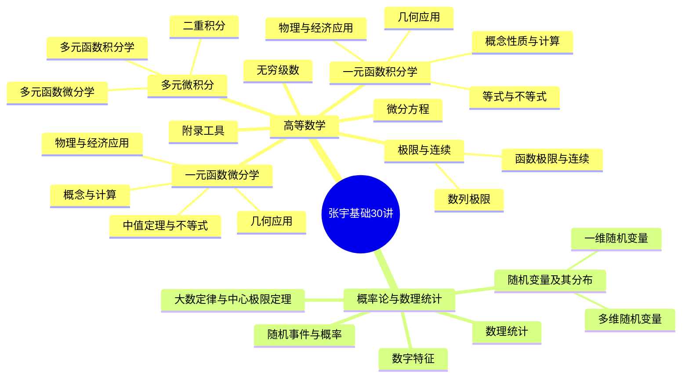

# 张宇基础30讲知识地图

> [!warning] 当前状态
> 已装配 **2 篇卷首资料 + 30 篇章节/附录 OCR 初稿**。
> 正文由 MinerU 3.4.5 从扫描 PDF 自动转换，未经逐页人工校验。

## 分册入口

- [[01-课程笔记/高等数学/00-高等数学分册目录|高等数学分册目录]]：18 讲 + 6 个附录
- [[01-课程笔记/高等数学/00-卷首资料|高等数学卷首资料]]：PDF 1–5
- [[01-课程笔记/概率论与数理统计/00-概率论与数理统计分册目录|概率论与数理统计分册目录]]：6 讲
- [[01-课程笔记/概率论与数理统计/00-卷首资料|概率论与数理统计卷首资料]]：PDF 1–6
- [[00-总览/张宇基础30讲课程地图.canvas|课程 Canvas]]
- [[00-总览/张宇基础30讲知识关联|知识关联总览]]
- [[00-总览/张宇基础30讲知识关联.canvas|知识关联 Canvas]]
- [[99-来源/来源说明|来源与页码说明]]

## 思维导图

## 完整导航

### 高等数学：第 01–06 讲

- [[01-课程笔记/高等数学/第01讲-函数极限与连续|第01讲 函数极限与连续]]
- [[01-课程笔记/高等数学/第02讲-数列极限|第02讲 数列极限]]
- [[01-课程笔记/高等数学/第03讲-一元函数微分学的概念|第03讲 一元函数微分学的概念]]
- [[01-课程笔记/高等数学/第04讲-一元函数微分学的计算|第04讲 一元函数微分学的计算]]
- [[01-课程笔记/高等数学/第05讲-一元函数微分学的应用（一）—几何应用|第05讲 一元函数微分学的应用（一）—几何应用]]
- [[01-课程笔记/高等数学/第06讲-一元函数微分学的应用（二）—中值定理、微分等式与微分不等式|第06讲 一元函数微分学的应用（二）—中值定理、微分等式与微分不等式]]

### 高等数学：第 07–12 讲

- [[01-课程笔记/高等数学/第07讲-一元函数微分学的应用（三）—物理应用与经济应用|第07讲 一元函数微分学的应用（三）—物理应用与经济应用]]
- [[01-课程笔记/高等数学/第08讲-一元函数积分学的概念与性质|第08讲 一元函数积分学的概念与性质]]
- [[01-课程笔记/高等数学/第09讲-一元函数积分学的计算|第09讲 一元函数积分学的计算]]
- [[01-课程笔记/高等数学/第10讲-一元函数积分学的应用（一）—几何应用|第10讲 一元函数积分学的应用（一）—几何应用]]
- [[01-课程笔记/高等数学/第11讲-一元函数积分学的应用（二）—积分等式与积分不等式|第11讲 一元函数积分学的应用（二）—积分等式与积分不等式]]
- [[01-课程笔记/高等数学/第12讲-一元函数积分学的应用（三）—物理应用与经济应用|第12讲 一元函数积分学的应用（三）—物理应用与经济应用]]

### 高等数学：第 13–18 讲

- [[01-课程笔记/高等数学/第13讲-多元函数微分学|第13讲 多元函数微分学]]
- [[01-课程笔记/高等数学/第14讲-二重积分|第14讲 二重积分]]
- [[01-课程笔记/高等数学/第15讲-微分方程|第15讲 微分方程]]
- [[01-课程笔记/高等数学/第16讲-无穷级数（仅数学一、数学三）|第16讲 无穷级数（仅数学一、数学三）]]
- [[01-课程笔记/高等数学/第17讲-多元函数积分学的预备知识（仅数学一）|第17讲 多元函数积分学的预备知识（仅数学一）]]
- [[01-课程笔记/高等数学/第18讲-多元函数积分学（仅数学一）|第18讲 多元函数积分学（仅数学一）]]

### 高等数学：附录

- [[01-课程笔记/高等数学/附录01-图像变换|附录01 图像变换]]
- [[01-课程笔记/高等数学/附录02-常用平面图形|附录02 常用平面图形]]
- [[01-课程笔记/高等数学/附录03-常用空间图形|附录03 常用空间图形]]
- [[01-课程笔记/高等数学/附录04-重要公式|附录04 重要公式]]
- [[01-课程笔记/高等数学/附录05-从指数函数到双曲函数|附录05 从指数函数到双曲函数]]
- [[01-课程笔记/高等数学/附录06-变形技巧|附录06 变形技巧]]

### 概率论与数理统计

- [[01-课程笔记/概率论与数理统计/第01讲-随机事件与概率|第01讲 随机事件与概率]]
- [[01-课程笔记/概率论与数理统计/第02讲-一维随机变量及其分布|第02讲 一维随机变量及其分布]]
- [[01-课程笔记/概率论与数理统计/第03讲-多维随机变量及其分布|第03讲 多维随机变量及其分布]]
- [[01-课程笔记/概率论与数理统计/第04讲-随机变量的数字特征|第04讲 随机变量的数字特征]]
- [[01-课程笔记/概率论与数理统计/第05讲-大数定律与中心极限定理|第05讲 大数定律与中心极限定理]]
- [[01-课程笔记/概率论与数理统计/第06讲-数理统计|第06讲 数理统计]]

## 后续整理入口

- [[02-知识点/00-知识点索引|知识点索引]]
- [[03-题型与方法/00-题型与方法索引|题型与方法索引]]
- [[90-模板/章节笔记模板|章节笔记模板]]

